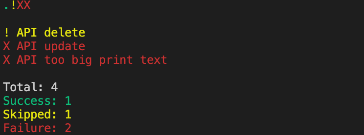

# Dot reporter for Dart/Flutter tests

Provided to make short and readable test report for your Dart/Flutter projects.

Inspired by [https://webdriver.io/docs/dot-reporter.html].

Sample output:



Best view for CI results review. :)

## Installation

If you want to use Dot reporter on the command line, install it using pub global activate:

> pub global activate dart_dot_reporter

To update it, use the same pub global activate command.

## Usage

At first you need to use machine readable reporter, here is example for Dart and Flutter.

### Dart

```bash
pub run test --reporter=json --coverage=./coverage > machine.log
dart_dot_reporter machine.log
```

### Flutter

```bash
flutter test --machine > machine.log
dart_dot_reporter machine.log
```

### Arguments

`dart_dot_reporter <machine.log> [flags]`

**NOTE:** Path to log file is required as first argument.

You can use one of next flags after path:

| Flag           | Description                                    |
| -------------- | ---------------------------------------------- |
| -h             | To get help. More info can be found on GitHub. |
| --hide-skip    | To hide output about skipped tests.            |
| --show-success | To show output about successfull tests.        |
| --show-id      | To show id of the test from Machine log.       |
| --show-message | To show error message of the failed test.      |
| --no-color     | To disable colors.                             |

## Known issues

- If test starts with **'loading /'** it will be skipped in report.

## TODO:

- Count time of execution, and display most slow tests

## Development

Run the app using `dart bin/main.dart`.

---

Created from templates made available by Stagehand under a BSD-style
[license](https://github.com/dart-lang/stagehand/blob/master/LICENSE).
