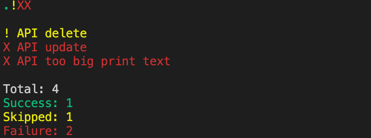

# Example

## Before

Such error log can be 10000 lines long.

```
00:01 +1 -1: test/dart_dot_reporter_test.dart: parser can parse file with lines containing json [E]
  Expected: TestModel:<TestModel { 29 State.Failure API update Expected: {
                        'id': 103                      }
              Actual: {
                        'ids': 102,
                      }
               Which: is missing map key 'id'
             }>
    Actual: TestModel:<TestModel { 29 State.Failure API update  Expected: {
                        'id': 103
                      }
              Actual: {
                        'ids': 102,
                      }
               Which: is missing map key 'id'
             }>

  package:test_api                       expect
  test/dart_dot_reporter_test.dart 37:7  main.<fn>.<fn>

00:01 +1 -2: test/dart_dot_reporter_test.dart: dot_reporter Ignore "loading" tests [E]
  Expected: <2>
    Actual: <5>
  Unexpected number of calls

  package:test_api                         expect
  package:mockito/src/mock.dart 866:5      VerificationResult.called
  test/dart_dot_reporter_test.dart 106:29  main.<fn>.<fn>
```

## After

```
.XX

X parser can parse file with lines containing json
X dot_reporter Ignore "loading" tests

Total: 3
Success: 1
Skipped: 0
Failure: 2
```

### After with color



### After with flags enabled

`dart_dot_reporter machine.log --show-message --show-success --show-id`

```
.!XX

27 . API getAll
28 ! API delete
29 X API update
  Expected: {
            'id': 103
          }
  Actual: {
            'ids': 102,
          }
  Which: is missing map key 'id'

31 X API too big print text

Total: 4
Success: 1
Skipped: 1
Failure: 2
```
